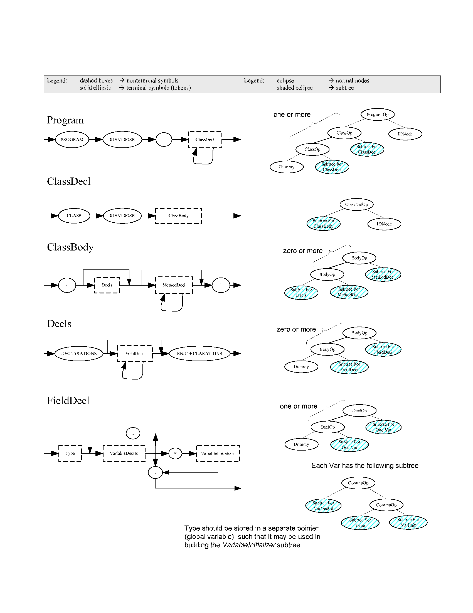

- [Project 2: Syntax Analysis](#project-2-syntax-analysis)
  * [Description](#description)
  * [Codespace Development Environment](#codespace-development-environment)
  * [Directory Structure and Makefile Script](#directory-structure-and-makefile-script)
  * [Implementation](#implementation)
    + [Completing lex.l](#completing-lexl)
    + [Completing table.cpp](#completing-tablecpp)
    + [Completing grammar.y](#completing-grammary)
  * [Appendix](#appendix)
    + [Appendix A: Data structures in proj2.h](#appendix-a-data-structures-in-proj2h)
    + [Appendix B: Helper functions in proj2.cpp](#appendix-b-helper-functions-in-proj2cpp)
    + [Appendix C: MINI-JAVA grammar specification](#appendix-c-mini-java-grammar-specification)
    + [Appendix D: Debugging by comparing Abstract Syntax Trees](#appendix-d-debugging-by-comparing-abstract-syntax-trees)
    + [Appendix E: Debugging using VSCode Debugger](#appendix-e-debugging-using-vscode-debugger)
  * [Grading](#grading)
  * [Submission](#submission)

# Project 2: Syntax Analysis

DUE: October 30 (Thursday), 2025 Before Class

Please accept Project 2 on **GitHub Classroom** using the following link: https://classroom.github.com/a/aK-KPdYL

The GitHub Classroom repository works the same way as your Project 1 repository.

## Description

In this phase of the project, you will write a syntax analyzer for the CS 1622
programming language, MINI-JAVA. The analyzer will consist of a parser, written
in Yacc, and routines to manage a string table, written in C/C++. The next
phase of the compiler project, semantic analysis, will traverse the abstract syntax tree
generated by syntax analysis and annotate tree nodes with semantic information
such as type information.  Please refer to the [Yacc (Yet Another
Compiler-Compiler)
tutorial](https://github.com/wonsunahn/CS1622_Fall2025/blob/main/resources/yacc.pdf)
in the course repository for reference.

## Codespace Development Environment

Please refer to the Project 1 CodeSpace Development Environment section to set
up the same development environment.  This time we need to install graphviz along
with flex to enable abstract syntax tree image generation:

```
sudo apt-get update
sudo apt-get install flex graphviz
```

Installing flex will install yacc along with it, and now you should be able to
build the parser binary by invoking the build target of the Makefile:

```
make build
```

This results in the following output:

```
$ make build
yacc -d -v  grammar.y 
gcc -g -c y.tab.c
g++ -g -c proj2.cpp
g++ -g -c table.cpp
g++ -g -c main.cpp
gcc -g -o parser y.tab.o proj2.o table.o main.o -ll -lstdc++
```

This is a flowchart representation of the build process of the parser:


## Directory Structure and Makefile Script

Here is an overview of the directory structure in alphabetical order.  The files that you are expected to modify are marked in bold:

* dotdiff.awk : An <tt>awk</tt> script for generating the difference between two graphviz parser tree images.
* **grammar.y** : Implements the parser using the Yacc language.  **Modify**.
* **lex.l** : Implements the lexer using the Lex language.  **Modify**.
* main.cpp : The test driver for the parser that contains the main function.
* Makefile: The build script for the make tool.
* proj2.cpp / proj2.h: Helper functions for the parser, pre-implemented for you.
* **table.cpp** : Implements the string table.  **Modify**.
* asts/ : Directory where graphviz (.gz) files of abstract syntax trees and their corresponding image files (.png) generated when running the parser are stored.
* asts_solution/ : Directory where the solution abstract syntax tree .gz and .png files are stored.
* diffs_asts/ : Directory where comparisons between asts/ and asts_solution/ are stored, generated by the <tt>dotdiff.awk</tt> tool.
* diffs_outputs/ : Directory where comparisons between outputs/ and outputs_solution/ are stored, generated by the <tt>diff</tt> command.
* outputs/ : Directory where outputs after running your parser on source files under tests/ are stored.
* outputs_solution/ : Directory where solution outputs after running the reference parser on source files under tests/ are stored.
* tests/ : Source files for testing and grading your parser.

As mentioned above, in order to just build the parser binary, you only need to invoke the build make target:

```
make build
```

To run the parser against the source files under tests/ after building, invoke the default make target:

```
make
```

The make script generates outputs and diffs in exactly the same way as in
Project 1.  If you wish to remove all files generated from the make script and
start from scratch, invoke the 'clean' target:

```
make clean
```

## Implementation

Your goal is to modify lex.l, table.cpp, and grammar.y so that your outputs are
identical to the solution outputs.  If you achieve that, the make build script
will show no errors when invoked, and all the .diff files under diffs_outputs/
will be empty when listed, just like for Project 1.  You will achieve this by
replacing the TODO comments in the source files as instructed in the comments.

You will complete lex.l and table.cpp mostly by reusing code that you wrote for
Project 1.  The bulk of your effort with be in completing grammar.y which
implements the parser using Yacc.  Yacc generates two C files from grammar.y,
y.tab.h and y.tab.c, that implements the parser.

### Completing lex.l

You can reuse the lex.l code that you submitted for Project 1, with a few
exceptions which I will explain here.  The difference at a high level is that
now the lexer is not operating standalone --- it is operating as part of the
parser.  In fact, you can see that lex.yy.c, which is the C file generated from
lex.l, is literally included at the bottom of the grammar.y parser
implementation file using the statement:

```
#include "lex.yy.c"
```

As such, you need to make a few changes to integrate the lexer into the parser.

1. Remove the #include of "token.h" from lex.l.

   You can see that all the tokens in the language is already defined in
grammar.y using the %token keyword.  When grammar.y is compiled into y.tab.h
and y.tab.c by the Yacc tool, all those tokens are defined in the y.tab.h file.
Hence, token.h is now redundant and is removed from the project. 

1. Remove the definition "int yycolumn, yyline, yylval;" from lex.l.

   You can see that yycolumn and yyline are already defined in grammar.y for
use inside the parse, so you should not redefine it in lex.l.  As to yylval, it
is not explicitly defined in grammar.y, but it is defined in the y.tab.c file
generated by Yacc from grammar.y.  Yylval is used in the parser in exactly the
same way we used it for Project 1: to store the lexeme values of tokens.

1. Change all references to "yylval" to "yylval.intg" in lex.l.

   Yylval is defined as YYSTYPE in y.tab.c.  YYSTYPE is the type that Yacc uses
to store and pass **semantic values** (also known as **attributes** in the
lecture slides) produced by **semantic actions** performed when grammar
production rules are applied.  As we learned, there is an attribute attached to
each symbol in the grammar, including terminals (tokens) and non-terminals.
The \$\$, \$1, \$2, and \$3 Yacc pseudo-variables used to refer to these
attribute values are all of type YYSTYPE.  YYSTYPE by default is defined as the
int type within Yacc.  Now, the int type may work to store semantic values for
terminals, also known as token lexemes, but it does not work well to store
semantic values for non-terminals.  The attributes for non-terminals are
typically pointers to an abstract syntax tree that represents that non-terminal.

   The %union keyword is used to redefine YYSTYPE as a union in grammar.y using the following lines:

   ```
   %union {
     int intg;
     tree tptr;
   }
   ```

   Now YYSTYPE is a C union type that is able to store either an int type or a
tree type in the same memory space.  Accessing yylval.intg will treat yylval as
an int type and accessing yylval.tptr will treat yylval as a tree type.  Here
is a [brief Wikipedia description of C union
types](https://en.wikipedia.org/wiki/C_data_types#Unions), if you need a
refresher.  Since all our lexemes are of int type, we want to store the lexeme
to yylval.intg in our lexer.

### Completing table.cpp

Again, you can reuse all the table.cpp code you wrote for Project 1.  Here are
the additional things needed.

1. Remove #include "token.h" and add #include "proj2.h", #include "y.tab.h".

   Again, token.h is now redundant.  All the tokens are defined in y.tab.h.

1. Change all references to "yylval" to "yylval.intg"

   This is for reasons identical to why we did this for lex.l, explained previously.

1. Write the additional function char* getString(int index).

   This function is used in the printTreeText() and printTreeGraphviz()
functions in proj2.cpp to print strings from the string table that corresponds
to identifier and string constant integer lexemes.

### Completing grammar.y

If you have completed both lex.l and table.cpp and you are this stage, please
try doing "make" again to regenerate the parser output files.  Then open
"outputs/err0.out".  If all went well, you should see the following content:

```
************* SYNTAX TREE PRINTOUT ***********

  +-[IDNode,0,"err0"]
R-[ProgramOp]
  +-[DUMMYnode]
```

This is a representation of a abstract syntax tree for the Program "tests/err0.mjava"
with a ProgramOp type root node with an IDNode right child and a DUMMYnode left
child.  The IDNode, which is a leaf node for an identifier, displays 0 as the
lexeme value of the identifier token, and the string "err0" at index 0 of the
string table.  This reflects the abstract syntax tree structure of Program shown in
[Appendix C: MINI-JAVA grammar
specification](#appendix-c-mini-java-grammar-specification).

Now, the solution output in "outputs_solution/err0.out" shows:

```
yyerror: syntax error at line 3
```

And this is because the specification for Program requires one or more Classes
to be declared in the file, and there are none in err0.mjava.  Line 3 is the
last line in the err0.mjava file, so that is where the parser emits the error
message while looking for a Class declaration.

Your job is to complete the grammar.y file so that the grammar adheres to the
given specifications, while writing the semantic actions to build the parse
tree.  When you are done, your grammar.y file should look something like the following:

```
%{ /* definition */
#include <stdlib.h>
#include <stdio.h>
#include "proj2.h"
...
%}

%union {
  int intg;
  tree tptr;
}

%token <intg> PROGRAMnum IDnum .... SCONSTnum
%type <tptr> Program ClassDecl ..... Variable

%% /* grammar specifications */

Program : PROGRAMnum IDnum SEMInum ClassDecl
{ $$ = MakeTree(ProgramOp, $4, MakeLeaf(IDNode, $2)); SyntaxTree = $$; }
;
/* other rules */
Expression : SimpleExpression {$$ = $1;}
| SimpleExpression Comp_op SimpleExpression
{ MkLeftC($1, $2); $$ = MkRightC($3, $2); }
;

%% /* user code */

int yycolumn = 1, yyline = 1;

void yyerror(char *str)
{
  printf("yyerror: %s at line %d\n", str, yyline);
  exit(0);
}

#include "lex.yy.c"
```

## Appendix

### Appendix A: Data structures in proj2.h

In proj2.h is the declaration of the treenode struct:

```
typedef struct treenode {
        int NodeKind, NodeOpType, IntVal;
        struct treenode *LeftC, *RightC;
} ILTree, *tree;
```

The NodeKind field distinguishes between the following types of nodes: IDNode,
NUMNode, STRINGNode, DUMMYNode, INTEGERTNode or EXPRNode. The first four leaf
node types correspond to an identifier, an integer constant, a string constant
and a null node type. A leaf node of INTEGERTNode type is created for "int"
type declarations, i.e. the node is created for every INTnum token. All
interior nodes are of the EXPRNode type.

Each leaf node assigns the IntVal field. For an ID or string constant node,
IntVal is the index into the string table. For a NUMNode, it is the value
itself. For an INTEGERTNode or DUMMYNode, it is always 0.

Each interior node assign the NodeOpType field, the values of which are defined
in proj2.h:

* ProgramOp: node for program, root node
* BodyOp: node for class body, method body, decl body, statmentlist body.
* DeclOp: node for each declaration
* CommaOp: node for "," operator
* ArrayTypeOp: node for array type
* TypeIdOp: node for type of a variable or method
* BoundOp: node for array bound in variable declaration
* HeadOp: node for head of method
* RArgTypeOp: node for each argument
* VargTypeOp: node for each argument specified by "VAL" .e.g. abc(VAL int x)
* StmtOp: node for statement
* IfElseOp: node for if-then-else
* LoopOp: node for while statement
* SpecOp: node for specification of parameters
* RoutineCallOp: node for routine call
* AssignOp: node for assign operator
* ReturnOp: node for return statement
* AddOp, SubOp, MultOp, DivOp, LTOp, GTOp, EQOp, NEOp, LEOp, GEOp, AndOp, OrOp, UnaryNegOp, NotOp: node for ALU operators
* VarOp: node for variables
* SelectOp: node for accessing an element/field variable
* IndexOp: node created when using "[]" to access an element
* FieldOp: node created when using "." to access a field
* ClassOp: node for each class
* MethodOp: node for each method
* ClassDefOp: node for each class defintion

Please refer to [Appendix C: MINI-JAVA grammar
specification](#appendix-c-mini-java-grammar-specification) for details of how
each node type is used in the abstract syntax tree.  You will be using functions MakeLeaf
and MakeTree, described in the following section, to create leaf nodes and
interior nodes respectively.

The test driver main method inside main.cpp looks like the following:

```
int main(int argc, char **argv)
{
  ...
  /* Make syntax tree */
  SyntaxTree = NULL;
  yyin = inputFile;
  yyparse();
  fclose(inputFile);
  ...
  /* Print out syntax tree to stdout. */
  treelst = stdout;
  printTreeText(SyntaxTree, 0);

  /* Print out syntax tree to graphviz file if requested. */
  if (treeimg != NULL)
    printTreeGraphviz(SyntaxTree, 0);

  return 0;
}
```

The yyin FILE pointer is a Lex variable that designates where to read the input
stream from.  The driver uses the inputFile passed in as commandline argument.
The yacc yyparse() call will initiate the parse process, culminating in the
execution of the semantic action of the start symbol Program, if the parse is
successful.  The semantic action for Program assigns the root of the abstract
syntax tree to SyntaxTree.

The treelst FILE pointer is what the parser uses for output.  Setting it to
stdout simply redirects all output to the console.  The printTreeText call will
print out a text-based representation of the abstract syntax tree to the
console.  If the -p option is passed to the commandline with a file path, a
graphviz image representation of the abstract syntax tree is stored to that
path.

### Appendix B: Helper functions in proj2.cpp

These functions are already fully implemented for your use.

* tree NullExp();

  Returns a null node with kind=DummyNode and semantic value=0.

* tree MakeLeaf(int Kind, int N);

  Returns a leaf node of specified Kind with integer semantic value N.

* tree MakeTree(int NodeOp, tree Left, tree Right);

  Returns an internal node, T, such that NodeOp(T)=Op; LeftChild(T)=Left; RightChild(T)=Right and NodeKind(T)=InteriorNode.

* int NodeOp(tree T);

  See MakeTree. Returns the integer constant representing NodeOpType of T if T is an interior node, else returns 0 (undefined op).  Uses NodeKind(T) to distinguish leaf from interior.

* int NodeKind(tree T);

  Returns the kind of node T.

* tree LeftChild(tree T);

  Returns pointer to left child of T. Returns pointer to null node if NodeKind(T) != InteriorNode.

* tree RightChild(tree T);

  Returns pointer to right child of T. Returns pointer to null node if NodeKind(T) != InteriorNode.

* int IntVal(tree T);

  See MakeLeaf. Returns integer semantic value of node T if NodeKind(T) == IDNode, STRGNode, NUMNode, or BOOLNode. Otherwise returns -1 (undefined).

* int IsNull(tree T); 

  returns true iff T is a null node.

* void SetNodeOp(tree T, int Op)

  NodeKind(T) must be InteriorNode. Makes NodeOp(T) = Op.

* void SetNodeKind(tree T, int Kind)

  NodeKind(T) must not be InteriorNode. Makes NodeKind(T) = Kind.

* void SetNodeVal(tree T, int Val)

  NodeKind(T) must not be InteriorNode. Makes IntVal(T) = Val.

* void SetLeftChild(tree T, tree NewChild)

  NodeKind(T) must be InteriorNode. Makes LeftChild(T) = NewChild.

* void SetRightChild(tree T, tree NewChild)

  NodeKind(T) must be InteriorNode. Makes RightChild(T) = NewChild.

### Appendix C: MINI-JAVA grammar specification

You can download the below grammar in [PDF format](proj2.appendixC.pdf), if you prefer.




### Appendix D: Debugging by comparing Abstract Syntax Trees

Just like for Project 1, you will be debugging your code by comparing your
output against the solution output.  For this project, the output is the
abstract syntax tree that you generate in text format (.out files under the
outputs/ folder) and image format (.png files under the asts/ folder).  The
solution files for each format is under outputs_solution/ and asts_solution/
respectively, along with the diff comparisons with your generated files under
diffs_outputs/ and diffs_asts/ respectively. 

Here is the asts_solution/minimal.png file that shows the abstract syntax tree
for tests/minimal.mjava, as an example: 


Here is the outputs_solution/minimal.out file that shows the same abstract
syntax tree this time in text format:

```
************* SYNTAX TREE PRINTOUT ***********

  +-[IDNode,0,"minimal"]
R-[ProgramOp]
  |   +-[IDNode,8,"c1"]
  | +-[ClassDefOp]
  | | +-[DUMMYnode]
  +-[ClassOp]
    +-[DUMMYnode]
```

You can see that the tree is rotated counter counterclockwise 90 degrees.  It
was an unavoidable choice to print the tree to the console.  You may find the
PNG image easier to view.

If you find it hard to tell the difference between your tree and the solution
tree visually, the diff files may help.  The .diff files under diffs_outputs/
folder shows the difference in the text format trees and the .png files under
the diffs_asts/ folder shows the difference in the image format trees.  The
.diff files will be empty if there are no differences (and this is what the
GradeScope autograder uses to determine your score).  If there are differences,
it will print out line-by-line differences as shown in the Wikipedia entry:
https://en.wikipedia.org/wiki/Diff#Default_output_format.

The .png files show the difference between the generated and solution tree
images.  For example, at below is the generated tree on the left, the solution
tree in the center, and the diff tree on the right.

<p float="left">


</p>

Here is the color legend:

* black : Nodes and edges both in the generated and solution trees.
* red : Nodes and edges only in the generated tree.
* blue : Nodes and edges only in the solution tree.
* orange : Nodes in both trees but the label is different.

The image comparison algorithm is not perfect so it may have trouble matching
identical nodes when the tree structure differ significantly.  So it may show
an identical node as deleted and added back in (one red and one blue) when the
algorithm does not recognize them as identical.

### Appendix E: Debugging using VSCode Debugger

You can click on the Debugger menu on the VSCode IDE to get to the RUN AND
DEBUG pane.  There you will see a play icon next to a drop box with <tt>Launch parser</tt>
selected.  You can click on that play icon to start debugging.  The
<tt>Launch parser</tt> selection is a launch configuration defined in the
[.vscode/launch.json](.vscode/launch.json) file.  In that file, you will see
that the <tt>args</tt> property is set with an input redirection to
<tt>${workspaceFolder}/tests/src0.mjava</tt>.  If you wish to debug with some
other input file, please change src0.mjava to some other .mjava file
under the tests/ folder.

If you are not familiar with VSCode debugging, here is a tutorial:
https://code.visualstudio.com/docs/editor/debugging

Note that you cannot put breakpoints on grammar.y on VSCode debugger, because
it is not a C/C++ source file.  However, you can put breakpoints on y.tab.c
that is generated from grammar.y.

## Grading

Each of the 12 tests under the tests/ folder is worth 10 points for a total of
120 points.  A diff failure on the output for one of these .mjava files will
result in a deduction of 10 points.

## Submission

When all tests pass, you are ready to submit.  Please submit your GitHub
Classroom repository to GradeScope at the "Project 2" link.  Once you submit,
GradeScope will run the autograder to grade you and give feedback.  If you get
deductions, fix your code based on the feedback and resubmit.  Repeat until you
don't get deductions.  The tests performed on GradeScope is identical to the
tests under the tests/ folder.

Don't forget that you have to Commit and Push your changes to upload them to
the repository.  Please review this tutorial if you don't remember how:

https://docs.github.com/en/codespaces/developing-in-a-codespace/using-source-control-in-your-codespace#committing-your-changes
